# 2019_TP_PPS_Comanda - ComiRadix

Registrate en: https://forms.gle/yZ8xsdWj7W7ECWAG8

Comenzamos decidiendo la estrategia git a utilizar para el trabajo en equipo, realizando algunas pruebas con distintos escenarios para determinar la manera de proceder en cada caso. Luego de las pruebas se determinó que utilizaremos la estrategia *mainline branching*.  
Luego de eso se observó la necesidad de utilizar firebase como motor de base de datos, para persistir la información, y determinamos el hecho de realizar un servicio que encapsule todos los movimientos hacia y desde la base de datos.  
Se planificaron las tareas a realizar a futuro, teniendo en cuenta prioridades y dependencias.  

Excel: Tareas y Funcionalidades
Link: https://docs.google.com/spreadsheets/d/1VdARvob4sYUyWulVDS7SBmX509Qe7wzXusUYa1eG-6c/edit#gid=0

Word: Coordinación y próximos pasos
Link: https://docs.google.com/document/d/1oEnzlbxtO-LMAgVBkn0KqyZpL6Fi04EdTZu34W6hYag/edit

## Sprint 1 13/05 - 18/05

1.- Generación de repositorio  
2.- Creación de estructura general de la aplicacion  
3.- Servicio Firebase  
4.- Login  
5.- Icono  
6.- Splash Screen animado con Logo de la aplicación  
7.- Formulario de entrada de datos y alta de producto en Firebase  
8.- Tomar foto desde galería para subir a FB  
9.- Organización interna

###Status Sprint 1
##Funcionalidades
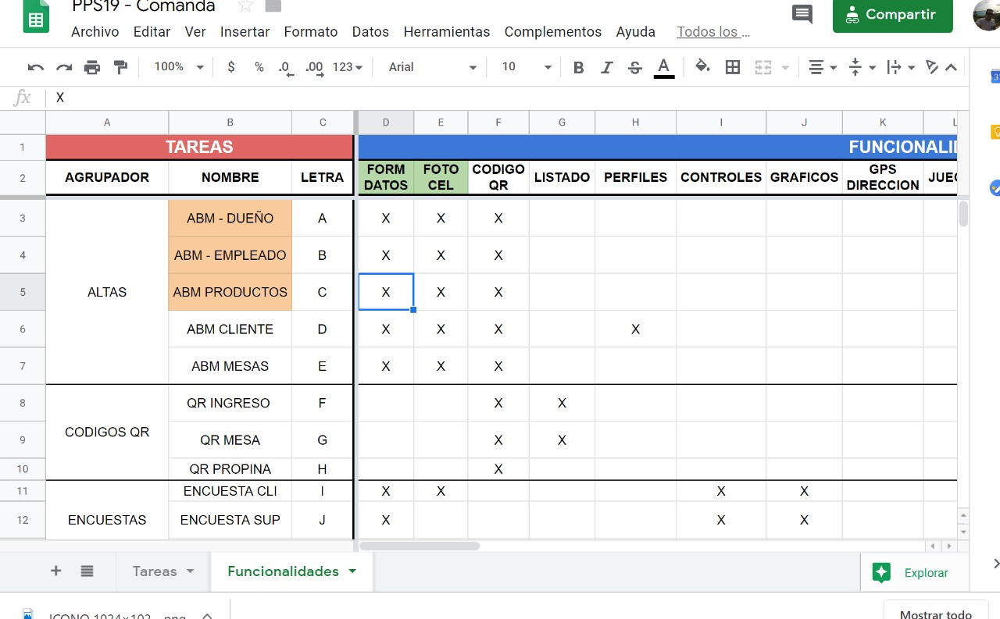
##Tareas
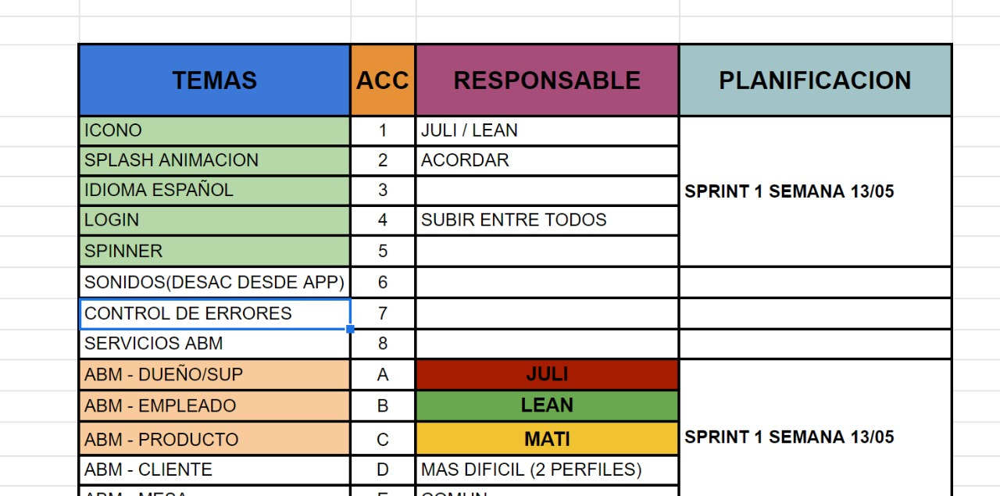

## Sprint 2 18/05 - 25/05

1.- Codigo QR
2.- Finalizar las altas pendientes
3.- Listado de imagenes u objetos en array  
4.- Manejo de distintos perfiles y usuarios

###Status Sprint 2
##Funcionalidades
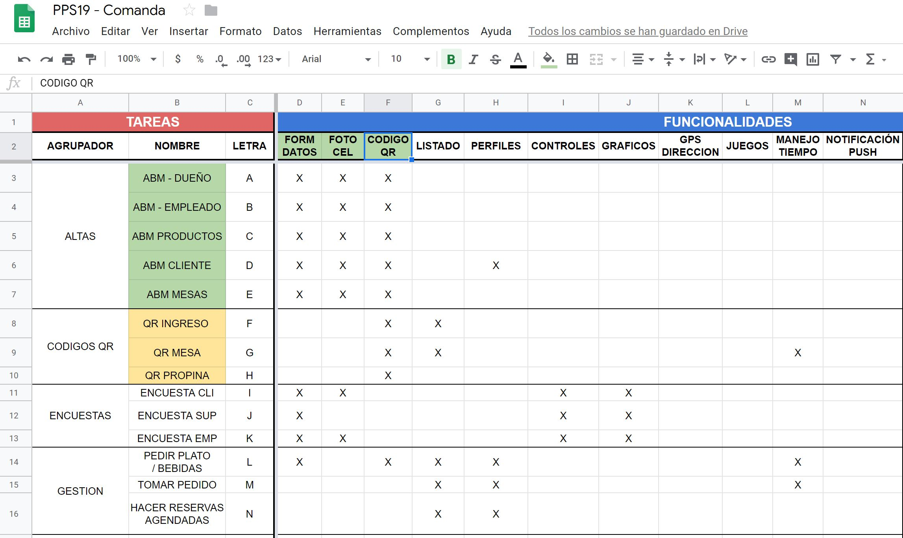
##Tareas
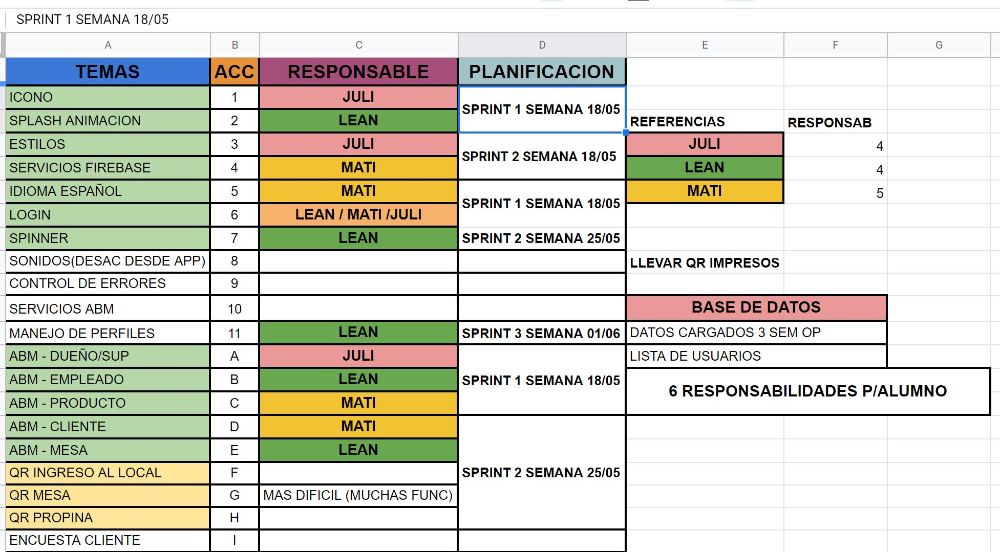

## Sprint 3 25/05 - 01/06

1.- QR Individuales
2.- Servicios de encuesta
3.- Graficos
4.- Input / Radio buttons
5.- Navegacion con perfiles 
6.- Pantallas por usuario
7.- Imagen previa al splash
8.- Reestiling de la app menues y efectos / Fondos blurreados

###Status Sprint 3
##Funcionalidades
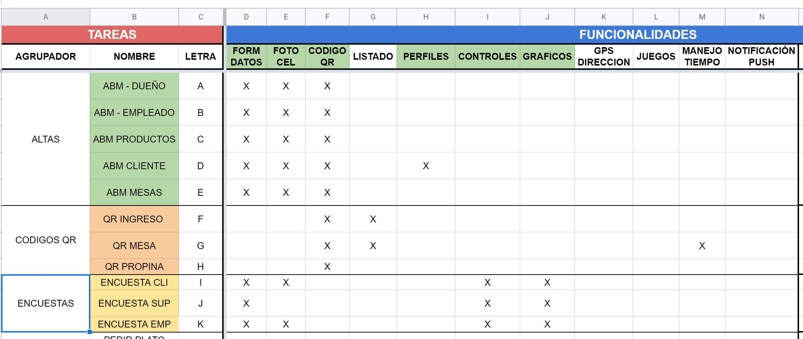
##Tareas
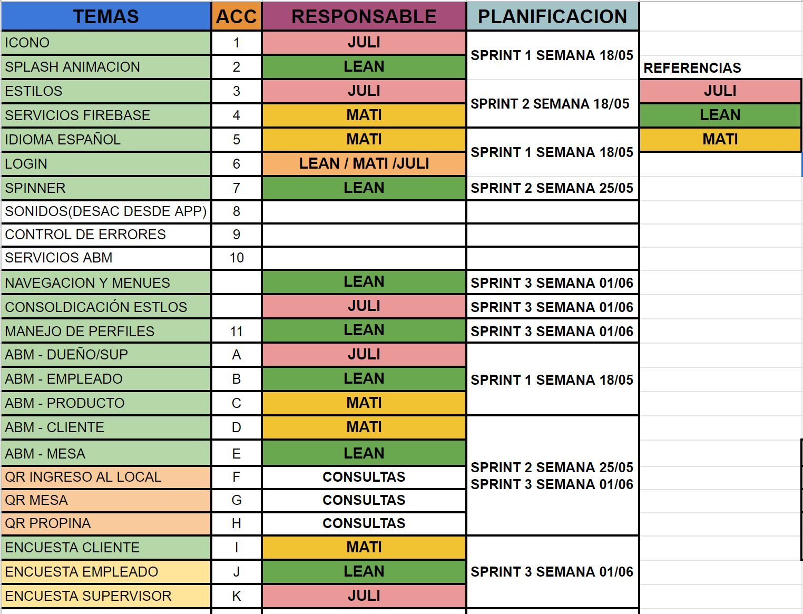
##Perfiles
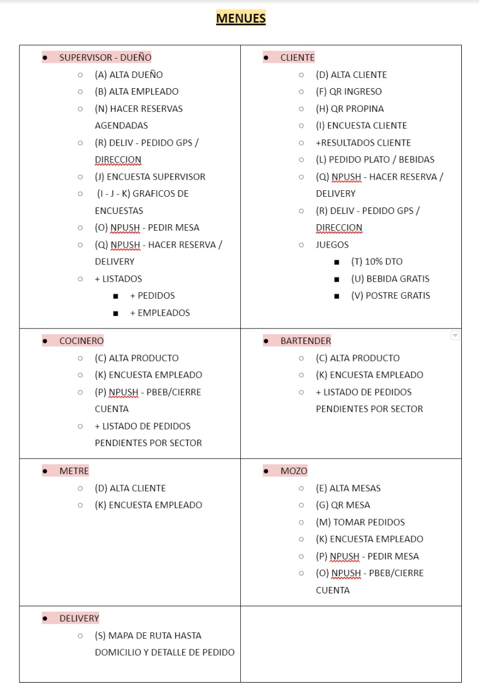

## Sprint 4 01/06 - 08/06

1.- Servicio envío mail
2.- Prueba envío mail
3.- Listado de clientes
4.- Aprobación de clientes
5.- Menu por perfiles
6.- Encuestas
7.- Reveer entidades

###Status Sprint 4
##Funcionalidades
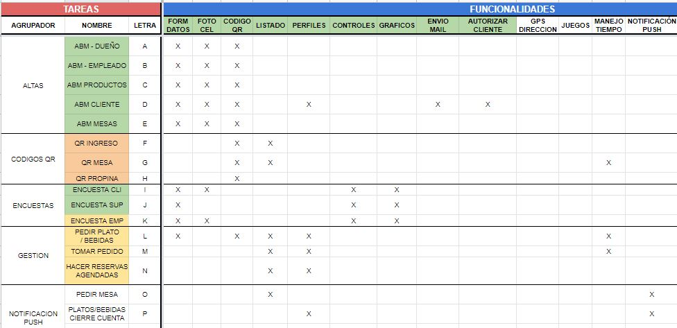
##Tareas
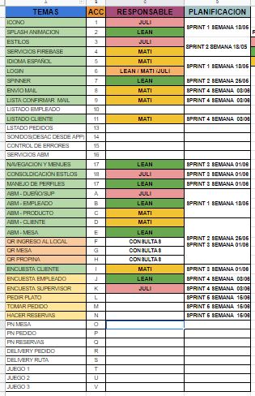
##Perfiles - DEFINITIVO
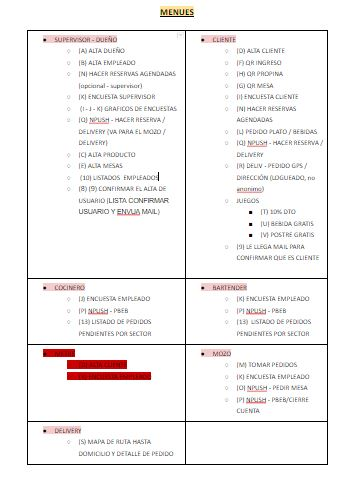

## Sprint 5 08/06 - 15/06

1.- Listado Empleados  
2.- Listado Pedidos  
3.- Listado Cliente esperando mesa  
4.- Aprobación circuito cliente en mesa  
5.- Aprobación circuito mozo con pedido  
6.- Estadísticas cliente por perfil  
7.- Estadísticas empleado por perfil  
8.- Estadísticas supervisor por perfil  
9.- QR Ingreso al local con perfiles  
10.- QR Mesa -> Distintos estados / Diagrama de flujo / asignacion de pedidos  
11.- QR Propina  
12.- Gestión -> Pedir Plato  
13.- Gestión -> Tomar pedido  

###Status Sprint 5
##Tareas  
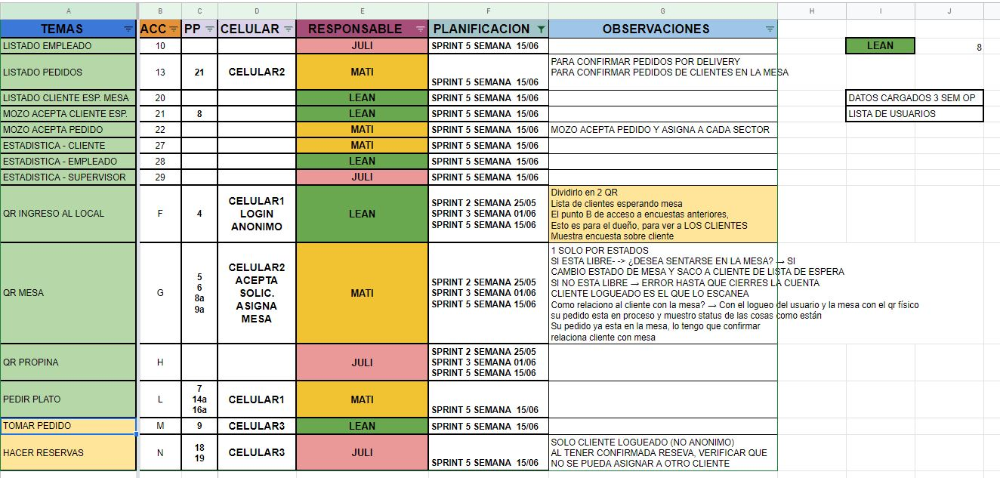  
##Funcionalidades  
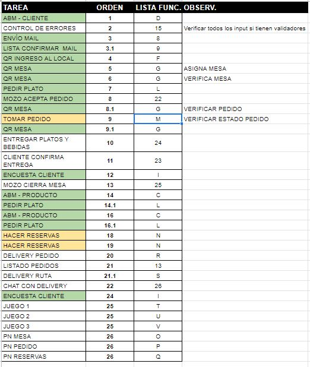  
##Diagrama flujo QR  
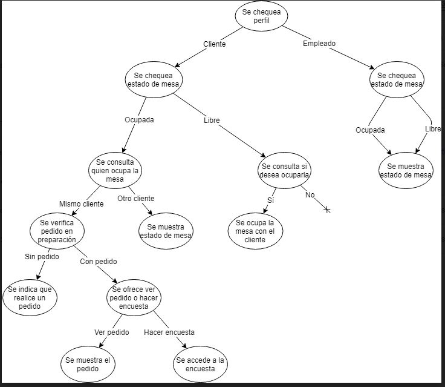  

## Sprint 6 15/06 - 22/06 - PRE ENTREGA

1.-CERRAR CIRCUITO DE PEDIDO
2-LISTADO PEDIDOS
3.-MOZO ACEPTA CLIENTE ESP.
4.-MOZO ACEPTA PEDIDO
5.-CLIENTE CONFIRMA ENTREGA
6.-ENTREGAR PLATOS Y BEBIDAS
7.-MOZO CIERRA MESA
8.-CHAT CON DELIVERY
9.-LISTADO PEDIDOS COCINA
10.-LISTADO PEDIDOS BARTENDER
11.-GESTION-TOMAR PEDIDO
12.-GESTION-HACER RESERVAS
13.-PUSH NOTIFICATION
14.-DELIVERY PEDIDO
15.-DELIVERY RUTA

###Status Sprint 6
##Tareas  
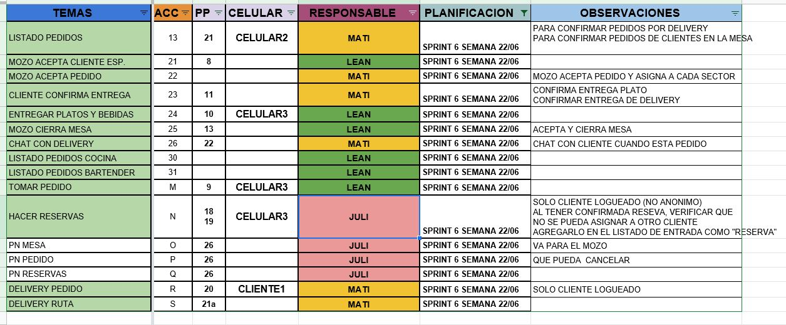  
##Circuito  
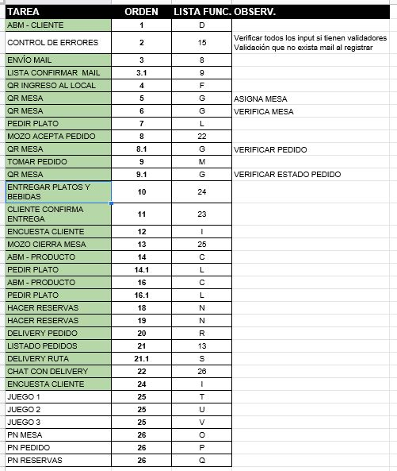  
##Funcionalidades  
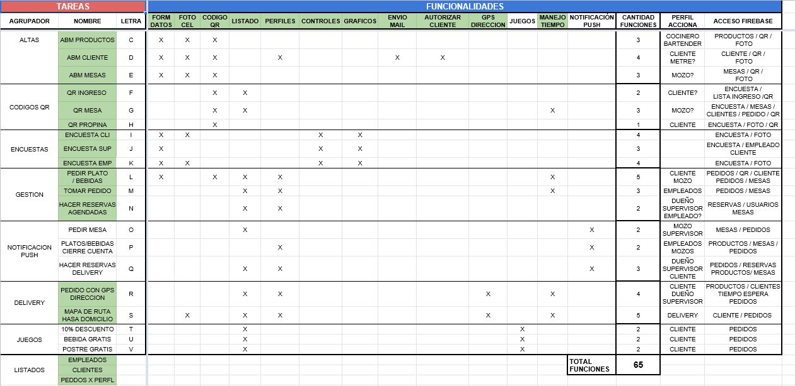 
##Diagrama flujo QR  
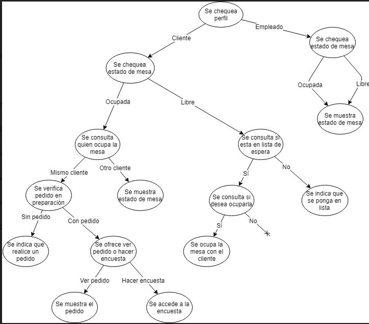  

## Sprint 7 12/06 - 29/06 - ENTREGA

1.-PRUEBA 1 Y 2 CIRCUITO COMPLETO (IMAGEN).
2.-FIX CORRECCIONES PUNTUALES PARA ENTREGA FINAL
2.1-MODIFICACIONES EN CLIENTE AL LOGEAR LUEGO DE CONFIRMACION
2.2-MODIFICIACIONES EN SUPERVISOR AL CONFIRMAR/RECHAZAR CLIENTE-RESERVA
2.3-CLIENTE PUEDE VER LISTA DE ESPERA
2.4-MODIFICACION PEDIDOS DELIVERY / PEDIDOS LOCAL
2.5-MODIFICACION CLIENTE AL YA TENER PEDIDO NO PODER MODIFICARLO (SI ESTA EN PREPARACION)
2.6-REVISION ESTADOS AL CREAR PEDIDO / VALIDAR
2.7-ACTUALIZAR PRECIOS (PROPINA EN PORCENTAJE)
2.8-VALIDACIONES EN ASIGNACION DE MESA CON QR
2.9-RESERVAS RECHAZADAS/ACEP POR SUPERVISOR
2.10-VALIDACION MESA SI ESTA RESERVADA
2.11-VALIDACION MESA LIBERADA DESPUES TIEMPO RESERVA
2.12-RECARGO DELIVERY
2.13-TIEMPO DE RUTA EN DELIVERY
2.14-ASIGNAR DIRECCION TOCANDO EN EL MAPA
2.15-CHAT UNO A UNO
2.16-FUERA LOCALSTORAGE DEL PROCESO
2.17-REFRESCAR LISTAS 
2.18-CSS GENERAL
2.19-FIX ABMS (IMG)
2.20-CORRECCIONES DE ENTREGA EN PEDIDO
2.21-FIX NUMERO PEDIDO EN LISTA
2.22-VALIDACION AL REGISTRARSE DE MAIL ANTERIOR
2.24-FIX QR INGRESO AL LOCAL
2.25-FIX QR ESCANEAR QR MESA
2.26-FIX CLIENTE ANONIMO / CIERRE MESA
2.26-NOTIFICACIONES PUSH 
2.27-JUEGOS

###Status Sprint 7
##Tareas  
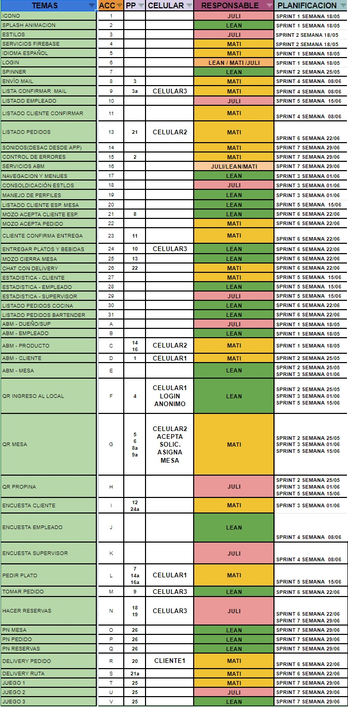  
##Funcionalidades  
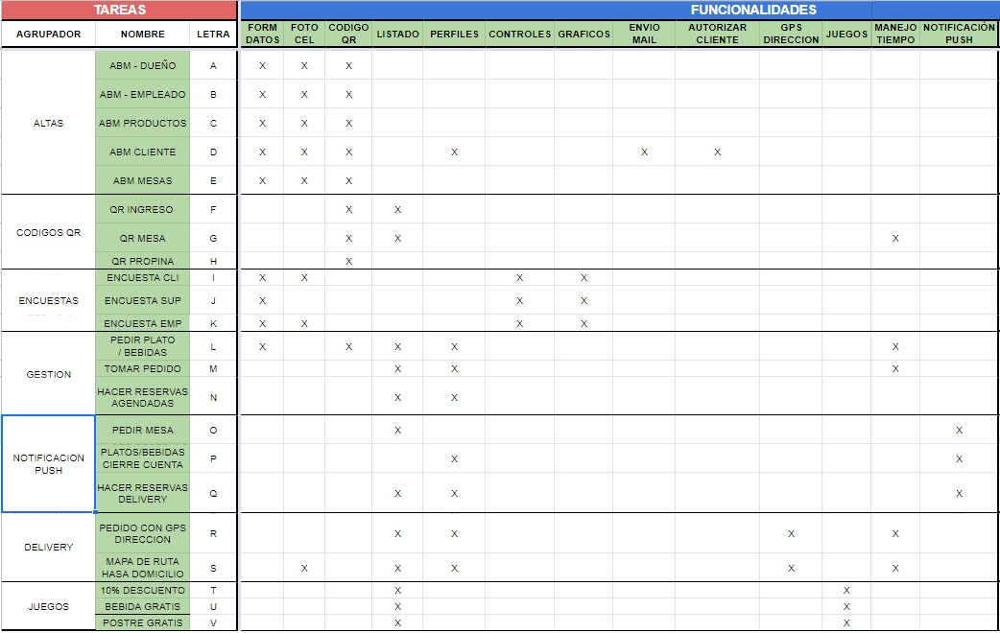 
##Diagrama flujo QR  
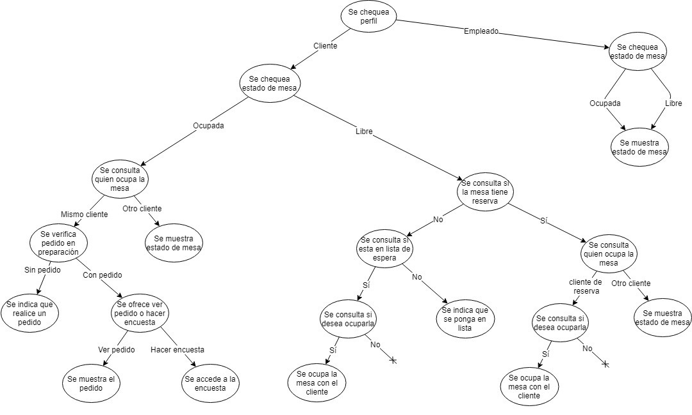  
##Pruebas Circuitos 
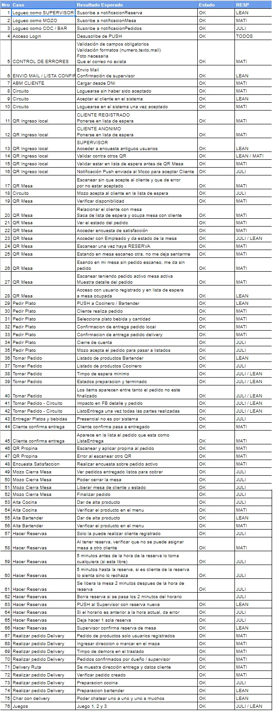  

## Responsabilidades para entrega 18/05 Sprint1
Nombre: Julián Graziano  
Módulo: Alta dueño/supervisor  
Fecha inicio: 15/05  
Fecha fin: 18/05  
branch: jngraziano  

Nombre: Leandro Pollola  
Módulo: Alta empleado  
Fecha inicio: 15/05  
Fecha fin: 18/05  
branch: lnpollola  
  
Nombre: Matías Sotomayor  
Módulo: Alta producto  
Fecha inicio: 15/05  
Fecha fin: 18/05  
branch: msotomayor  

En común:
**Navegación por side-menu y tabs**  
**Navegabilidad de la aplicación**  
**Logo**  
**Splash**  
**Login**  
**Servicios Firebase**

## Responsabilidades para entrega 25/05 Sprint2
Nombre: Julián Graziano  
Módulo: Estilos / Alta / QR
Fecha inicio: 18/05  
Fecha fin:  25/05
branch: jngraziano  

Nombre: Leandro Pollola  
Módulo: Navegacion / Altas / QR
Fecha inicio: 18/05  
Fecha fin:   25/05
branch: lnpollola  
  
Nombre: Matías Sotomayor  
Módulo:   SERVICIOS / ALTA / QR
Fecha inicio: 18/05  
Fecha fin:   25/05
branch: msotomayor  

En común:
**Funcionalidad QR**  
**OK ALTA FOTO**  
**ESTILOS**  
**ORGANIACIÓN INTERNA**
**PERFILES Y NAVEGACION**

## Responsabilidades para entrega 01/06 Sprint3
Nombre: Julián Graziano  
Módulo: QR / Estilos / Encuesta
Fecha inicio: 25/05  
Fecha fin: 01/06 
branch: jngraziano  

Nombre: Leandro Pollola  
Módulo: Perfiles / Encuesta / Estilos
Fecha inicio: 25/05 
Fecha fin: 01/06   
branch: lnpollola  
  
Nombre: Matías Sotomayor  
Módulo:   SERVICIOS / QR / Encuesta
Fecha inicio: 25/05  
Fecha fin: 01/06   
branch: msotomayor  

En común:
**ESTILOS**

## Responsabilidades para entrega 08/06 Sprint4
Nombre: Julián Graziano  
Módulo: Encuesta / Estilos / Menu
Fecha inicio: 01/06  
Fecha fin: 08/06 
branch: jngraziano  

Nombre: Leandro Pollola  
Módulo: Encuesta / Navegabilidad / Menu por perfiles
Fecha inicio: 01/06
Fecha fin: 08/06   
branch: lnpollola  
  
Nombre: Matías Sotomayor  
Módulo:   Envío mail / Servicio QR / Gestión
Fecha inicio: 01/06  
Fecha fin: 08/06   
branch: msotomayor  

En común:
**REVEER ENTIDADES**
**FIREBASE ENCUESTAS**
**DEFINICION DE PERFILES Y MENUES**

## Responsabilidades para entrega 15/06 Sprint5
Nombre: Julián Graziano  
Módulo: Listado cliente / QR Propina / Estadísticas / Encuesta / Estilos
Fecha inicio: 08/06  
Fecha fin: 15/06
branch: jngraziano  

Nombre: Leandro Pollola  
Módulo: Listado empleados / Listado Pedidos / Aprobación circuito cliente en mesa / 
Estadística empleado por perfil / Menu y navegación / Cliente anónimo y registrado / 
QR Ingreso al local / Gestión -> Tomar pedido
Fecha inicio: 08/06
Fecha fin: 15/06   
branch: lnpollola  
  
Nombre: Matías Sotomayor  
Módulo: Listado Pedidos / Aprobación circuito mozo con pedido / Estadística cliente / 
Estadistica cliente por perfil / QR Mesa / Gestión -> Pedir Plato /
Listado de pedidos con circuito de aprobación
Fecha inicio: 08/06  
Fecha fin: 15/06   
branch: msotomayor  

En común:
**REVEER ENTIDADES**  
**DEFINICIÓN DE NAVEGACIÓN POR MENU**  
**CAMBIO EN LA ESTRUCTURA DE BD PARA DAR INTEGRIDAD**  
**ANALISIS DE FUNCIONALIDADES MINIMAS Y CIRCUITO**  
**DEFINICIÓN DE ESTADOS DE PEDIDO Y MESAS**  

## Responsabilidades para entrega 22/06 Sprint6 -PRE ENTREGA
Nombre: Julián Graziano  
Módulo: 
Fecha inicio: 15/06  
Fecha fin: 22/06
branch: jngraziano  

Nombre: Leandro Pollola  
Módulo: 
Fecha inicio: 15/06
Fecha fin: 22/06   
branch: lnpollola  
  
Nombre: Matías Sotomayor  
Módulo: 
Fecha inicio: 15/06  
Fecha fin: 22/06   
branch: msotomayor  

En común:
**REVEER ENTIDADES PEDIDOS, MESAS, PRODUCTOS, USUARIOS**  
**DEFINICION DE CIRCUITOS Y PROCESOS**  
**AVANCE EN FUNCIONALIDAD MINIMA,CONEXION ENTRE COMPONENTES**  
**ESTILING Y PUSH NOTIFICATION**  
